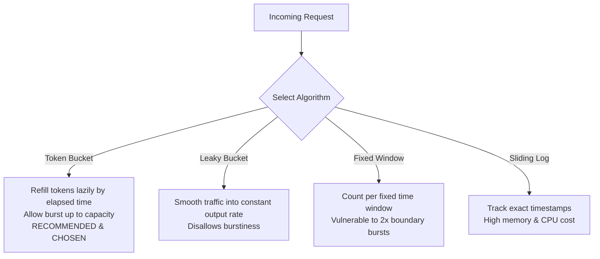
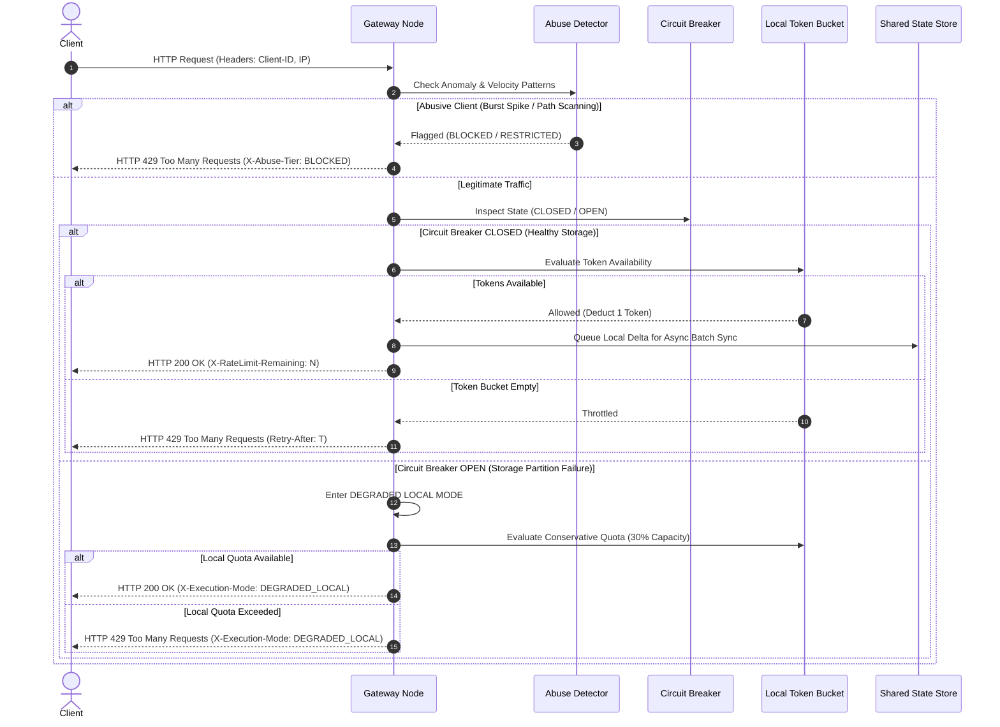
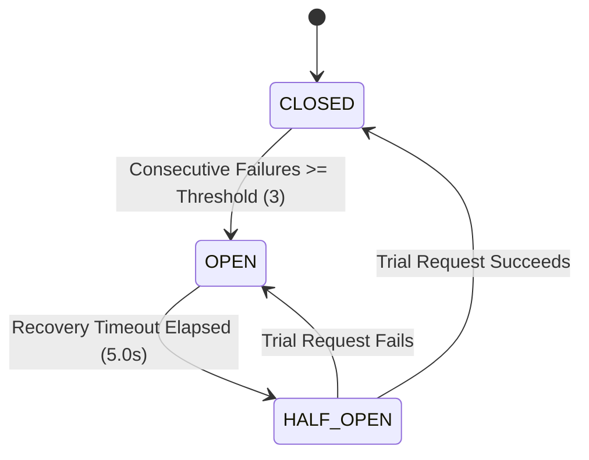

# High Level Design (HLD) Document
## Distributed Rate Limiting & Abuse Detection System

---

## 1. System Overview & Problem Statement

In modern distributed software architectures, Application Programming Interfaces (APIs) serve as the primary entry points for clients, web applications, mobile apps, and third-party services. Without strict incoming traffic controls, backend microservices are vulnerable to:
- **Excessive & Uncontrolled Traffic Spikes**: Cascading service degradation and server pool exhaustion.
- **Malicious Bot Attacks & Web Scraping**: Automated inventory hoarding, credential stuffing, and data extraction.
- **Denial-of-Service (DoS) Attempts**: Intentional resource depletion targeting expensive backend operations or database queries.

Analogous to a **traffic police system** that regulates vehicle flow on highways to prevent severe traffic congestion and accidents, a **Distributed Rate Limiter** acts as an API gateway safeguard. It enforces request quotas per client tier, shields downstream backend services, and ensures fair usage across clients—all while maintaining microsecond-level evaluation latency, horizontal scalability, and fault tolerance.

---

## 2. Core Architectural Trade-offs

Designing a distributed rate limiter requires navigating several fundamental system engineering trade-offs rather than searching for absolute solutions:

| Trade-off Dimension | Challenge | Design Mitigation & Selected Strategy |
| :--- | :--- | :--- |
| **1. Latency vs. Precision** | Synchronous cross-datacenter locks introduce 20-50ms network overhead per API request. | **Eventual Consistency with Asynchronous Batch Syncing**: Rate limiting decisions are evaluated locally on gateway nodes in $< 0.1 \text{ ms}$, with counter deltas batched and synced out-of-band. |
| **2. False Positives vs. Security** | Overly restrictive limits block legitimate users; overly lenient limits allow backend overload. | **Dynamic Token Bucket & Tiered Abuse Detection**: Allows natural traffic bursts while monitoring short-window velocity and anomaly patterns (e.g., 404 scanning). |
| **3. Operational Complexity vs. Scale** | Centralized counters create single points of failure and database bottlenecks as traffic scales horizontally. | **Distributed Shared State with Local Micro-Caching**: State is partitioned across in-memory clusters with local fallback quotas. |

### System Scope & Explicit Exclusions
To maintain strict focus on core rate limiting and abuse prevention:
- ❌ **Excluded**: UI Operational Dashboards (administrative management), Billing / Metering engines, Authentication / Identity Provider logic, and L3/L4 Network WAF / Volumetric DDoS mitigations.
- ✅ **Included**: L7 API Gateway Rate Limiting, Token Bucket Engine, Multi-node Eventual Consistency Synchronization, Circuit Breaker Resilience, Degraded Local Mode Fallback, and Pattern-Based Abuse Detection.

---

## 3. Consistency Model Analysis

The consistency model dictates how request counts are synchronized across distributed gateway nodes.

```
                  +-----------------------------------+
                  |      Client API Request           |
                  +-----------------------------------+
                                    |
                                    v
                  +-----------------------------------+
                  |    Distributed Gateway Layer      |
                  |  [Node 1]   [Node 2]   [Node 3]   |
                  +-----------------------------------+
                     /              |              \
                    /               |               \
                   v                v                v
            [Local Bucket 1] [Local Bucket 2] [Local Bucket 3]
                   \                |                /
                    \               |               /
               Async Batch Sync (Gossip / 50ms Flush)
                                    |
                                    v
                  +-----------------------------------+
                  |  Distributed Shared State Store   |
                  |     (Redis Cluster Abstraction)   |
                  +-----------------------------------+
```

### Strong Consistency vs. Eventual Consistency

1. **Strong Consistency (Synchronous Consensus / Redis Multi-Exec / Distributed Locks)**
   - *Pros*: Zero request over-counting across nodes; absolute strictness.
   - *Cons*: High latency penalty ($20-100\text{ ms}$ per request), reduced availability during network partitions, and central storage bottleneck.
   - *Use Case*: Strict payment processing, financial transactions, billing APIs.

2. **Eventual Consistency (Asynchronous Delta Flushing)** (*Selected Strategy*)
   - *Pros*: Microsecond-level local evaluation latency ($< 0.05\text{ ms}$), $99.999\%$ gateway availability, seamless horizontal scaling.
   - *Cons*: Slight temporary over-limit traffic during short synchronization windows ($\approx 50-100\text{ ms}$).
   - *Justification*: Since the system does not handle billing or monetary transactions, speed and low latency are prioritized over absolute sub-second precision.

---

## 4. Algorithm Selection & Analysis

We evaluated four fundamental rate limiting algorithms:



### Algorithm Comparison Matrix

| Algorithm | Burst Allowance | Memory Cost | Computation Complexity | Boundary Vulnerability | Decision |
| :--- | :--- | :--- | :--- | :--- | :--- |
| **Token Bucket** | **High (Up to Capacity)** | $O(1)$ per client | $O(1)$ Lazy Timestamp Refill | None | **SELECTED** |
| **Leaky Bucket** | None (Smooth Leak) | $O(N)$ Queue Size | $O(1)$ Continuous Leak | None | Rejected |
| **Fixed Window** | Medium | $O(1)$ per window | $O(1)$ Simple Increment | **2x Limit Spike at Boundary** | Rejected |
| **Sliding Window Log**| High | $O(K)$ Request Logs | $O(K)$ Log Trimming | None | Rejected |

**Selected Algorithm**: **Token Bucket Algorithm**. Tokens are refilled lazily based on elapsed time:
$$\text{Tokens}_{\text{current}} = \min\left(\text{Capacity}, \text{Tokens}_{\text{previous}} + \Delta t \times \text{RefillRate}\right)$$

---

## 5. State Topologies & Shared Storage Model

```
   [ Topology A: Centralized ]      [ Topology B: Distributed Shared (Chosen) ]
     Gateway 1   Gateway 2            Gateway 1 (Local)  Gateway 2 (Local)
         \          /                         \                /
          v        v                           v              v
     +-----------------+                 [Async Batch Sync Engine]
     | Central Redis   |                            |
     +-----------------+                 +-------------------------+
                                         | Partitioned Redis Cache |
                                         +-------------------------+
```

### Topologies Evaluated
1. **Centralized State**: All gateway nodes query a central Redis instance on every request. Creates high network round-trips and a single point of failure.
2. **Local State Only**: Each gateway node tracks counters in isolate memory. Easily bypassed by routing traffic across different nodes.
3. **Distributed Shared State with Local Micro-Caching** (*Selected*): Gateway nodes maintain local token buckets for fast evaluation. Counter deltas are asynchronously flushed to a partitioned shared state store at configurable intervals ($100\text{ ms}$).

---

## 6. Runtime Decision Flow & Sequence Architecture



---

## 7. Resilience, Failure Modes & Circuit Breaking

When shared storage experiences network partitions, slow network responses, or server crashes, the rate limiter must enforce a deterministic failure policy:



### Failure Handling Comparison

| Strategy | Behavior on Failure | Risk Profile | Production Suitability |
| :--- | :--- | :--- | :--- |
| **Fail Closed** | Block all incoming API requests | $100\%$ Outage for legitimate users | Payment Gateways Only |
| **Fail Open** | Allow all incoming API requests | Risk of backend service crash | Non-critical Public Read APIs |
| **Degraded Local Mode** (*Selected*) | Fallback to conservative per-node local quotas ($30\%$ of capacity) | Preserves gateway availability while preventing unthrottled backend load | **High-Scale API Gateways** |

---

## 8. Pattern-Based Abuse & Anomaly Detection

Beyond standard rate limiting, the system incorporates an **Abuse Detection Engine** to defend against zero-day bots and scanners:

1. **Short-Window Velocity Spikes**: Detects clients exceeding $3\times$ their refill rate within a 1-second window.
2. **Suspicious Path Probing**: Monitors accumulated HTTP 404/403 errors per client. Clients exceeding 10 error responses per minute are downgraded to a **RESTRICTED** tier ($25\%$ quota allowance). Continued scanning ($25+$ errors) triggers a temporary **BLOCKED** penalty (HTTP 429 with 60s cooldown).

---

## 9. Bounded Accuracy & Mathematical Bounds

In an eventual consistency model with $N$ gateway nodes and an asynchronous sync interval $T_{\text{sync}}$, the theoretical maximum request over-counting error $\Delta E$ per client is bounded by:

$$\Delta E \le (N - 1) \times \text{RefillRate} \times T_{\text{sync}}$$

For a 3-node cluster syncing every $100\text{ ms}$ with a refill rate of $10\text{ req/sec}$:
$$\Delta E \le (3 - 1) \times 10 \times 0.1 = 2 \text{ requests}$$

This guarantees that while clients may occasionally burst up to 2 extra requests across node boundaries during flush intervals, sustained abuse is strictly bounded and prevented.
